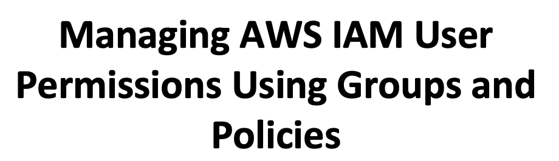

# About This Lab
In this hands-on lab scenario, I will be working as a security engineer for a new startup. We are launching an online bookstore for rare and antique books. Our founder and CEO, Kia, has asked me to set up the development team with the proper access permissions. To provide access and ensure the proper security measures are in place, I will use AWS Identity & Access Management (IAM). I will group users and assign permissions for the developer group using policies.

*This lab is part of the A Cloud Guru AWS Certified Cloud Practitioner 2020 course curriculum. For more information about A Cloud Guru and this couse please click [here](https://acloud.guru/overview/aws-certified-cloud-practitioner?_ga=2.251324549.226935666.1612970094-940664086.1612792344).* 

# Learning Objectives
- [x] Create a Customer-Managed Policy
- [x] Create a Group Controlled via a Customer-Managed Policy
- [x] Assign Users to a Group

# Lab Walkthrough & Details

## Scenario
Kia is a software engineer turned entrepreneur. She's launching her startup on AWS. She has hired several developers to help build an online bookstore for rare and antique books. She has asked me to help secure her resources using Identity and Access Management (IAM).

We will start out with just users and AWS resources. I will create and add these users to a developer group. Finally, this developer group will get full access via policy to the following DynamoDB, Lambda, S3 Bucket, and API Gateway.

## How We'll Help
We will help Kia by doing the following:
1. Grouping Users
1. Assigning Permissions Using Policies To Those Groups
1. Follow Best Practices

## Walkthrough

After logging into AWS I will navigate to the IAM service. This is done by: 
1. Clicking on the Services dropdown menu
1. Scrolling down to the Security, Identity, & Compliance section
1. Clicking on the IAM service

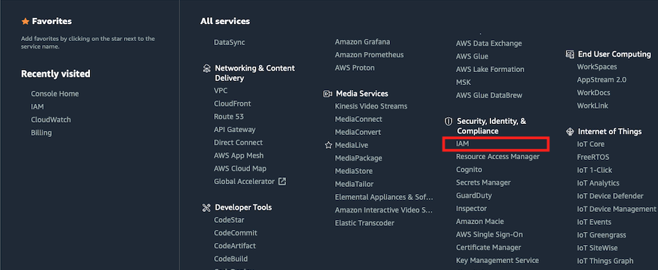

Once the IAM dashboard is loaded I see that there are 4 users already present.

Clicking on these 4 users will bring up additional user information. On this new page I can see the following accounts:
* cloud_user (This is the account that I used to log into AWS)
* developer-1
* developer-2
* developer-3

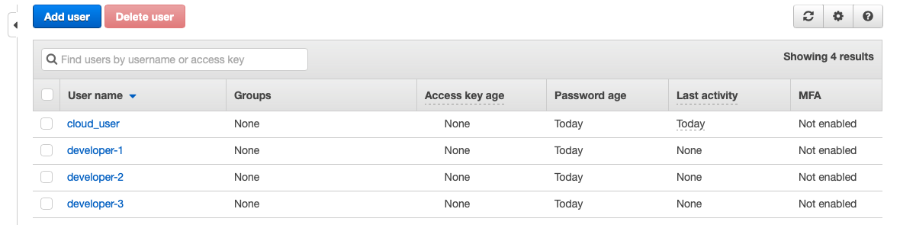

### Create Customer Managed Policy
I will now create a policy that will give access to the services that these developers need. This is done by:
1. Clicking on the Policies option found on the left-hand side toolbar
2. Clicking on the Create policy button

With the Create policy dashboard now open I have two options on how I want to create a policy. The first is via the Visual editor and the second is via JSON. For this lab, I will use the Visual editor. With the Visual editor tab selected I will fill out the following options:

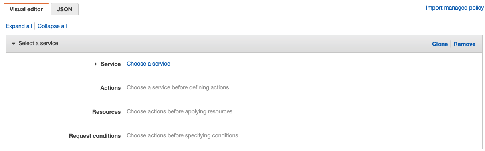

### DynamoDB Permissions 
* **Service:** DynamoDB
* **Manual Actions:** Check off "All DynamoDB actions" (This will give full access to our developers)
* **Resources:** Check off "All Resources"

Once this is completed I will select the "**+ Add additional permissions**" to add the the other services. I will select the following to give our developers full access to the Lambda service.

### Lambda Permissions
* **Service:** Lambda
* **Manual Actions:** Check off "All Lambda actions" (This will give full access to our developers)
* **Resources:** Check off "All Resources"

Once this is completed I will select the "**+ Add additional permissions**" to add the other services. I will select the following to give our developers full access to the S3 service.

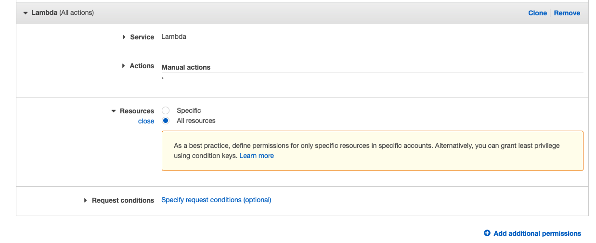

### S3 Permissions
* **Service:** S3
* **Manual Actions:** Check off "All S3 actions" (This will give full access to our developers)
* **Resources:** Check off "All Resources"

Once this is completed I will select the "**+ Add additional permissions**" to add the final service. I will select the following to give our developers full access to the API Gateway service.

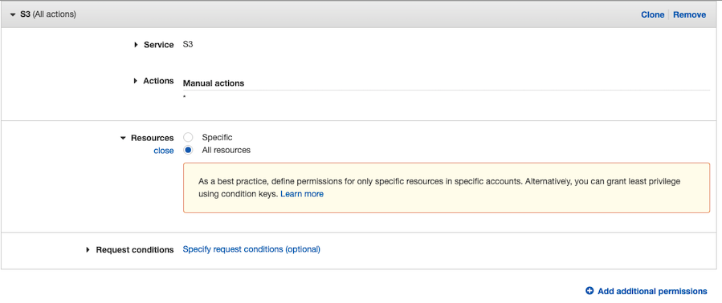

### API Gateway Permissions
* **Service: API Gateway
* **Manual Actions:** Check off "All API Gateway actions" (This will give full access to our developers)
* **Resources:** Check off "All Resources

_**Note:** In this lab we are using AWS managed policies (policies that AWS provides straight out of the box). It is good practice to start with AWS policies 1st. If these policies do not meet our needs then make our own. *_

Once complete I will hit the 'Next: Tags" button. 

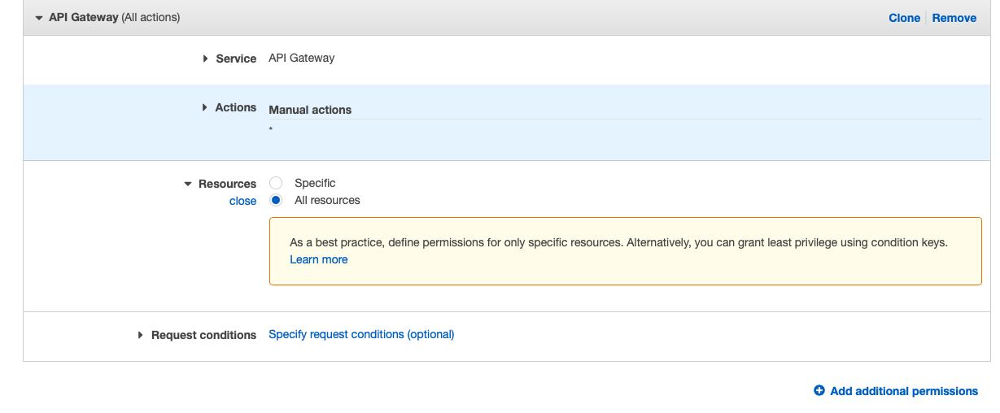

To recap what I just did. I have created a policy that gives full access to DynamoDB, Lambda, S3, API gateway. Under the tags menu, I will hit the "Next: Review" button. In this section, I will be required to give a name to this policy. I could add a brief description which might be helpful but is not required by AWS. It is a best practice to use a standard naming convention for all policies. The naming convention I will use is the following:

1. **Application Name or Project Name:** onlinebookstore
1. **Environment:** dev
1. **Group:** developergroup
1. **Access Type:** fullaccess
1. **Simple Description:** iam-policy

*Please note that the - is used a seperator instead of space*

**Final name:** onlinebookstore-dev-developergroup-fullaccess-iam-policy

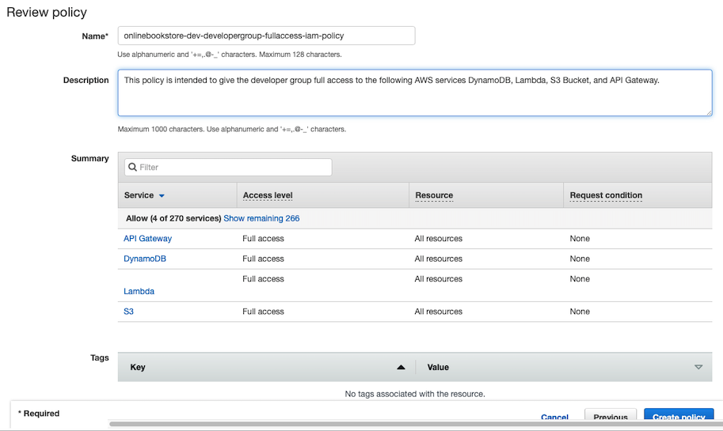

Once completed I will hit the "Create Policy" button. I will be redirected back to the Identity and Access Managment dashboard where if succesful will see a message stating that the onlinebookstore-dev-developergroup-fullaccess-iam-policy has been created.

### Creating Group
With the policy now created I need to create the developer group. This is done by:
1. Clicking on the Groups option found on the left-hand side toolbar
1. Clicking on the Create New Group button
1. Set the group name to Developers and hit the Next Step button
1. I will attach the developergroup-fullaccess-iam-policy by searching and selecting it. Once selected I will hit the Next Step.
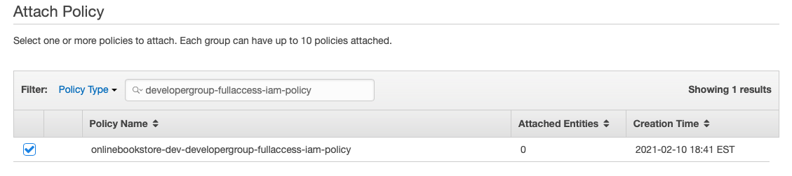
1. After reviewing and confirming the group I will be redirected back to the Group dashboard. The developer group should now be visible with 0 users in it.
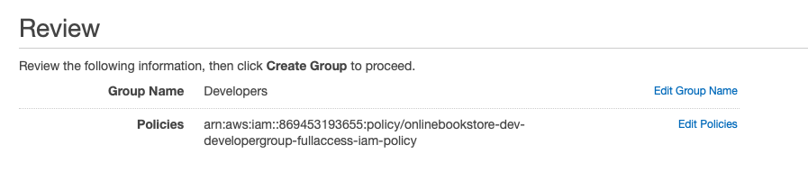
1. To add our developers to this group I will click on the developer group name. 
1. I will click on the "Add Users to Group" button found on the users' tab
1. Next I will select the 3 developer users (developer-1, developer-2, developer-3)by check-marking and hitting the Add users button.
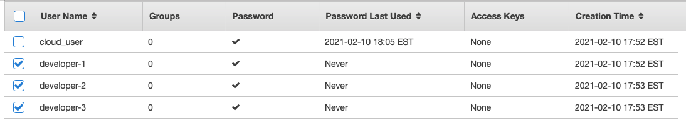

At this point, I have secured the resources using Identity and Access Management (IAM). I have created a developers group, assigned the developers to this group, and defined the access permissions which gave our development team access to DynamoDB, Lambda, S3 Bucket, and API Gateway.

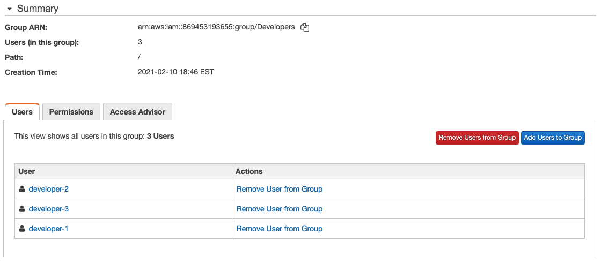

